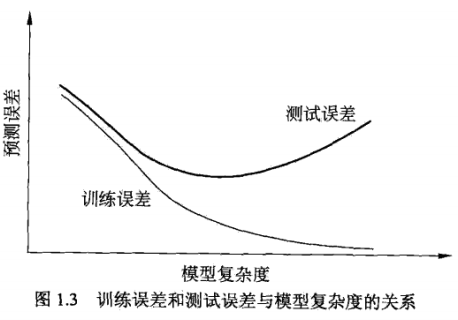
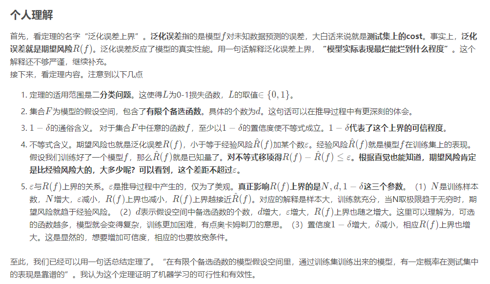

# **第一章 统计学习方法概论**

> 内容概要：

* 内容概括：简要叙述统计学习方法的基本概念

* 主要内容：监督学习

* 统计学习方法三要素
   * 模型
   * 策略
   * 算法

* 正则化
* 交叉验证
* 学习的泛化能力
* 生成模型与判别模型
* 监督学习方法的应用
   * 分类问题
   * 标注问题
   * 回归问题

## **1.1 统计学习**
* 统计学习是关于计算机基于构建概率统计模型并运用模型对数据进行预测与分析的一门学科
* 学习：如果一个系统能够通过执行某个过程改进他的性能，这就是学习
* 统计学习的对象：数据
* 目的：预测及分析
* 方法
  * **监督学习(本书重点)**
  * 非监督学习
  * 半监督学习
  * 强化学习

## **1.2 监督学习**
* 任务：学习一个模型，使得模型能够对任意给定的输入，对其相应的输出做一个好的预测。

### **1.2.1 基本概念**
* 输入空间与输出空间：将输入与输出所有可能取值的集合分别成为输入与输出空间。
* 特征空间：每一个具体的输入是一个实例，由特征向量表示，所有特征向量存在的空间称为特征空间。
* 联合概率分布：P(X,Y)
* 假设空间：监督学习的目的即学习一个从输入到输出的映射，该映射由模型表示，学习的目的就是找到最好的模型。模型属于由输入空间到输出空间的映射的集合，这个集合就是假设空间。

### **1.2.2 问题的形式化**
* 监督学习一般分为学习和预测两个过程。
* 当$\,\hat{P}\,$取最大值时$\,y_{N+1}\,$的值
$$
y_{N+1}\,=\,{\underset {y_{N+1}}{\operatorname {arg\,max} }}\,\hat{P}(y_{N+1}\mid x_{N+1})
$$

## **1.3 统计学习三要素**
> 方法=模型+策略+算法

### **1.3.1 模型**
* 要学习的条件概率分布或者决策函数

### **1.3.2 策略**
> 损失函数：度量模型一次预测的好坏

> 风险函数：度量平均意义下模型预测的好坏

* 0-1损失函数：

$$
L(Y,f(X))=\begin{cases} 1 & Y \neq f(x) \\ 0 & Y = f(x) \end{cases} 
$$
* 平方损失函数：

$$
L(Y,f(X))=(Y-f(X))^2
$$
* 绝对损失函数：

$$
L(Y,f(X))=\mid(Y-f(X))\mid
$$
* 对数损失函数：

$$
L(Y,f(X))=-\log P(Y\mid X)
$$

* 损失函数值越小，模型就越好，因为模型输入输出(X,Y)是随机变量，遵循联合分布P(X,Y)，所以损失函数期望是：
$$
期望=\int_{-\infty}^{+\infty}损失函数\times概率\,dxdy
\\
R_{exp}(f)=E_p[L(Y,f(X))]=\int_{\chi\times\gamma} L(y,f(x))P(x,y)dxdy
$$
* $R_{exp}(f)$就是风险函数。即基于联合分布，损失函数的期望就是风险函数。学习的目标就是选择风险函数最小的模型。

* 给定一个训练数据集，模型f(X)关于训练集的平均损失称为经验风险（经验损失），记作$R_{emp}$。
$$
R_{emp}(f)=\frac{1}{N}\sum_{i=1}^N L(y_i,f(x_i))
$$
* 期望风险是模型关于联合分布的期望损失。经验风险是模型关于训练样本的平均损失。由大数定律，当样本的容量N趋于无穷大时，经验风险趋近于期望风险，所以很自然的想用经验风险代替期望风险，但是现实中N很有限甚至很小，所以**用经验风险估计期望风险很不理想**。所以要对经验风险进行矫正。这就关系到监督学习的两个基本策略：**经验风险最小化和结构风险最小化**。

> 经验风险最小化和结构风险最小化

* 经验风险最小化认为经验风险最小的模型就是最优模型。
  * 样本容量足够时，有很好的学习效果
  * 样本容量不够时，产生过拟合现象
* 结构风险最小化（为了防止过拟合而提出的）等价于正则化。结构风险在经验风险的基础上再加上罚项（正则化项）。

$$
结构风险=经验风险+罚项\\
R_{srm}(f)=\frac{1}{N}\sum_{i=1}^N L(y_i,f(x_i))+\lambda J(f)\\
其中\lambda\geq0是系数，J(f)是模型复杂度。模型越复杂，J(f)越大。
$$
* 求最优模型，就是求解最优化的问题：

$$
\min _{f\in \Gamma}\, \frac{1}{N}\sum_{i=1}^N L(y_i,f(x_i))+\lambda J(f)
$$

### **1.3.3 算法**
* 算法：用什么样的计算方法求解最优模型。

## **1.4 模型评估与模型选择**

### **1.4.1 训练误差与测试误差**
* 假定学到模型$\,Y=\hat{f}(x)\,$，训练误差是模型$\,Y=\hat{f}(x)\,$关于训练数据集的平均损失：

$$
R_{emp}(\hat{f})=\frac{1}{N}\sum_{i=1}^N L(y_i,\hat{f}(x_i)),N是训练集。
$$
* 测试误差是模型 关于测试数据集的平均损失:

$$
\varrho _{test}=\frac{1}{N\prime}\sum_{i=1}^{N\prime} L(y_i,\hat{f}(x_i))，N\prime是测试集。
$$

* 若采用0-1损失，则测试数据集上的误差率：

$$
e _{test}=\frac{1}{N\prime}\sum_{i=1}^{N\prime} I(y_i\neq\hat{f}(x_i))，其中I是指示函数。
$$
* 相应的，测试集上的准确率：

$$
r _{test}=\frac{1}{N\prime}\sum_{i=1}^{N\prime} I(y_i=\hat{f}(x_i))
$$
* 显然$\,r_{test}+e_{test}=1\,$。
* 训练误差对于判定给定的问题是不是容易学习有帮助。测试误差反映了学习方法对未知测试集的预测能力。

### **1.4.2 过拟合与模型选择**
* 假定在假设空间中存在一个“真”模型，但我们不知道“真”模型是哪个，但我们选择的模型应尽可能接近“真”模型。
* 如果一味的追求训练数据集的预测能力，所选择的模型**复杂度**往往比“真”模型更高。这种现象就是过拟合。

* 模型选择方法：正则化与交叉验证。

## **1.5 正则化与交叉验证**

### **1.5.1 正则化**
* 正则化项具有如下形式：

$$
\min _{f \in \Gamma} \frac{1}{N}\sum_{i=1}^N L(y_i,f(x_i))+\lambda J(f);\\
当损失函数是平方损失：
L(w) = \frac{1}{N}\sum_{i=1}^N (f(x_i;w)-y_i)^2)+\frac{\lambda}{2} \mid\mid w\mid\mid ^2
$$
* 若第一项经验风险较小，则模型可能较复杂，即第二项较大，正则化的作用就是选择两项都较小的模型。
* 正则化项可以是参数向量的$\,L_p\,$范数。

* $L_p$范数：

$$
\sqrt[p]{\sum_{i=1}^n x_i^p}
$$

### **1.5.1 交叉验证**
* 基本想法：重复的使用数据。把给定的数据集进行划分，将划分的数据集组合为训练集和测试集，在此基础上反复训练、测试以及模型选择。
* 简单交叉验证：将数据集分为两部分，一部分用于训练，一部分用于测试，用训练集在各种条件下训练模型，在测试集上评估各个模型的测试误差，选择误差最小的模型。
* S折交叉验证：将给出的数据集分为S份互不相交的子集，利用S-1个子集进行训练，余下的子集进行测试。将这一过程对可能的S种选择重复进行，选出S次评估中误差最小的模型。
* 留一交叉验证：特殊情况，S=N，N是数据集个数。

## **1.6 泛化能力**

* 泛化能力是指该方法学习到模型对未知数据的预测能力。

### **1.6.1 泛化误差**
* 若学到的模型为f，则该模型对未知数据预测的误差即泛化误差为：
$$
R_{exp}(f)=E_p[L(Y,f(X))]=\int_{\chi\times\gamma} L(y,f(x))P(x,y)dxdy
$$

### **1.6.2 泛化误差上界**
* 首先：
$$
期望风险：R(f)=E[L(Y,f(X))];\\
经验风险：\hat{R}(f)=\frac{1}{N}\sum_{i=1}^N L(y_i,f(x_i));
$$
* 定理：对于二分类问题，当假设空间是有限个函数的集合$F=\{f_1,f_2,...,f_d\}$时，对任意的一个函数$\,f\in F\,$，至少以概率$\,1-\delta\,$，以下不等式成立：
$$
R(f)\leq \hat{R}(f)+\varepsilon (d,N,\delta)\\
其中，\varepsilon (d,N,\delta)=\sqrt{\frac{1}{2N}(\log d +\log \frac{1}{\delta})}
$$
​
* Hoeffding不等式：设$X_1,X_2,...,X_N$是独立随机变量，且$X_i\in[a_i,b_i],i=1,2,...,N$；$\bar{X}$是$X_1,X_2,...,X_N$的经验均值，即$\bar{X}=\frac{1}{N}\sum_{i=1}^NX_i$，则对任意的$t>0$，以下不等式成立：
$$
P(S_n-ES_n\geq t)\leq exp(\frac{-2t^2}{\sum_{i=1}^n(b_i-a_i)^2})\\
P(ES_n-S_n\geq t)\leq exp(\frac{-2t^2}{\sum_{i=1}^n(b_i-a_i)^2})
$$
* 可知：

$$
对单个f：P(R(f)-\hat{R}(f)\geq \varepsilon)\leq exp(-2N\varepsilon^2)\\
对所有集合F：P(\exists f\in F: R(f)-\hat{R}(f)\geq \varepsilon)\leq d \,exp(-2N\varepsilon^2)\\
等价的，对任意f\in F，有：P(R(f)-\hat{R}(f)< \varepsilon)\geq 1-d\,exp(-2N\varepsilon^2)\\
令\delta=d\,exp(-2N\varepsilon^2)\\
则：P(R(f)<\hat{R}(f) +\varepsilon)\geq 1-\delta，证毕。
$$
> 误差上界的理解：

> 以上图片：
————————————————
版权声明：本文为CSDN博主「DamianGao」的原创文章，遵循CC 4.0 BY-SA版权协议，转载请附上原文出处链接及本声明。
原文链接：https://blog.csdn.net/ghr19961014/article/details/104549797/

## **1.7 生成模型与判别模型**
* 生成模型
  * 朴素贝叶斯法
  * 隐马尔可夫模型

* 判别方法
  * K近邻法
  * 感知机
  * 决策树
  * 逻辑斯蒂回归模型
  * 最大熵模型
  * 支持向量机
  * 提升方法
  * 条件随机场

## **1.8 分类问题**
* TP：正正
* FN：正负
* FP：负正
* TN：负负
* 精确率：

$$
P=\frac{TP}{TP+FP}
$$
* 召回率

$$
P=\frac{TP}{TP+FN}
$$

* 精确率和召回率的调和均值

$$
F_1=\frac{2TP}{2TP+FP+FN}
$$

## **1.9 标注问题**
* 隐马尔可夫模型
* 条件随机场

## **1.10 回归问题**
* 该问题等价于函数拟合