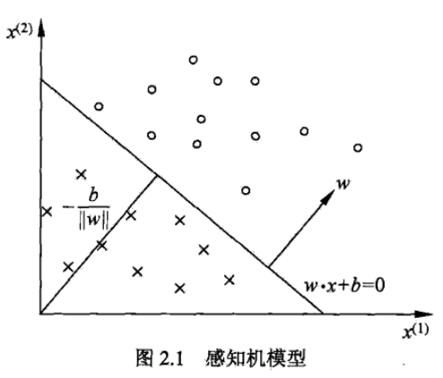
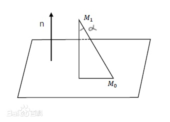
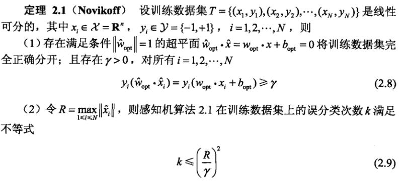

# **第二章 感知机**
> 感知机是二分类的线性分类模型，分为原始形式和对偶形式。是神经网络和支持向量机的基础。

1. 介绍感知机模型
2. 叙述感知机的学习策略（特别是损失函数）
3. 介绍感知机学习算法（包括原始形式和对偶形式），并验证算法收敛性。

## **2.1 感知机模型**
* **定义 2.1（感知机）** 假设输入空间（特征空间）是$\,\chi\subseteq R^n\,$，输出空间是$\,Y=\{+1,-1\}\,$。输入$\,x\in \chi\,$，表示实例的特征向量，对应于输入空间（特征空间）的点，输出$\,y\in Y\,$表示实例的类别。由输入空间到输出空间的如下函数称为感知机：
$$
f(x)=sign(w·x+b)\\
其中，w和b是感知机模型的参数.
w\in R^n 叫做权值，b叫做偏置.\\
w·x表示w和x的内积.
sign是符号函数，即：\\
sign(x)=\begin{cases} +1 & x\geq0 \\ -1 & x<0 \end{cases} 
$$

* **几何解释：**
> 线性方程
> $$
w·x+b=0
> $$
> 对应于特征空间$\, R^n\,$中的一个超平面S。其中$\, w,$是超平面的法向量，$\, b\,$是超平面的截距，该超平面将特征空间划分为两部分。因此超平面S成为分离超平面。
> <div align=center>
> 
> </div>
> 存在的问题：为什么加负号？
> 
> 对$
-\frac{b}{\mid\mid w\mid\mid}
> $的理解：
> 
> 三维平面下，点到面的距离公式：
> $$
平面\Pi :Ax+By+Cz+D=0,法向量为\vec{n}=(A,B,C)\\
平面外一点M_1(x_1,y_1,z_1)\\
平面上取一点M_0\\
则点M_1到\Pi 的距离：d=\mid\mid\vec{M_0M_1}\mid\mid\cos \alpha\\
其中\alpha是\vec{n}与\vec{M_0M_1}的夹角\\
\vec{M_0M_1}·\vec{n}=\mid\mid\vec{M_0M_1}\mid\mid·\mid\mid\vec{n}\mid\mid\cos \alpha\\
因此：\cos \alpha=\frac{\vec{M_0M_1}·\vec{n}}{\mid\mid\vec{M_0M_1}\mid\mid·\mid\mid\vec{n}\mid\mid}\\
故：d=\frac{\vec{M_0M_1}·\vec{n}}{\mid\mid\vec{n}\mid\mid}\\
而：\vec{M_0M_1}·\vec{n}=\mid A(x_1-x_0)+B(y_1-y_0)+C(z_1-z_0)\mid\\
点M_0在平面上，所以\vec{M_0M_1}·\vec{n}=\mid Ax_1+By_1+Cz_1+D\mid\\
所以：d=\frac{\mid Ax_1+By_1+Cz_1+D\mid}{\mid\mid\vec{n}\mid\mid}\\
> $$
> <div align=center>
> 
> </div>
> 其次：
> 
> $$
y=w·x+b\\
法向量\vec{n}=w\\
D=b
原点：x_1=0,y_1=0,z_1=0
> $$
> 引申到n维，到原点距离：
> $$
d=\frac{wx+b}{\mid\mid w\mid\mid}=\frac{\mid b \mid}{\mid\mid w\mid\mid}
> $$

## **2.2 感知机学习策略**
### **2.2.1 数据集的线性可分性**
* **定义 2.2 （数据集线性可分性）**：给定一个数据集，如果存在一个超平面，能将数据集中的正实例点和负实例点完全正确的划分在超平面两侧，则称该数据集为线性可分数据集。

### **2.2.2 感知机学习策略**
* 由上可知，输入空间任一点$x_0$到超平面S的距离：

$$
d=\frac{1}{\mid\mid w \mid \mid}\mid w·x_0+b\mid
$$
* 假定$y_i=+1$时，有$w·x+b>0$.
* 故，对于误分类点，有

$$
-y_i(w·x_i+b)>0
$$
* 所以，误分类的点$x_i$到超平面的距离是

$$
-\frac{1}{\mid\mid w\mid\mid}y_i(w·x_i+b)
$$
* 假设所有误分类的点集合为$M$，那么所有误分类点到超平面S距离是

$$
-\frac{1}{\mid\mid w\mid\mid}\sum _{x_i \in M}y_i(w·x_i+b)
$$
* 不考虑系数，就得到感知机学习的损失函数

$$
L(w,b)=-\sum _{x_i \in M}y_i(w·x_i+b)
$$
* 该损失函数即感知机学习的**经验风险函数**。
* 显然损失函数非负。
* 对一个特定的样本点的损失函数，在误分类时是参数$w,b$的线性函数，正确分类时是0，因此给定数据集$T$，损失函数$L(w,b)$是$w,b$的可导函数。


## **2.3 感知机学习算法**
* 感知机学习问题转化为求解损失函数的最优化问题。

### **2.3.1 感知机学习算法的原始形式**
* 问题

$$
\min _{w,b}L(w,b)=-\sum _{x_i \in M}y_i (w·x_i+b)
$$
* 采用随机梯度下降法。首先，任意选取超平面$w_0,b_0$，然后用梯度下降法不断极小化目标函数。极小化的过程不是一次使$M$中的所有误分类点梯度下降，而是一次随机选取一个误分类点使其梯度下降。
* 损失函数$L(w,b)$梯度：

$$
\nabla_wL(w,b)=-\sum _{x_i \in M}y_ix_i\\
\nabla_bL(w,b)=-\sum _{x_i \in M}y_i
$$
* 随机选取误分类点$(x_i,y_i)$，对$w,b$更新：

$$
w\leftarrow w+\eta y_ix_i\\
b\leftarrow b+\eta y_i\\
其中,\eta 是步长.
$$
* 例2.1
```python
"""
正实例点：(3,3),(4,3)
负实例点：(1,1)
"""
import numpy as np

x = np.array([[3, 3], [4, 3], [1, 1]])
y = [1, 1, -1]
eta = 1
w = [0, 0]
b = 0


def is_correct(_x, _y, _w, _b):
    """
    判断是否有分类错误的点
    :param _x: 点集坐标
    :param _y: 真实分类结果
    :param _w: 权重
    :param _b: 偏置
    :return: 是否有错，错误的点的坐标，错误点的序号
    """
    flag = -1
    _wrong = False
    a = 0
    for _i in range(0, len(_y)):
        if _y[_i] * (np.dot(_x[_i], _w) + _b) <= 0:
            flag = _i
            _wrong = True
            a = _i
            break
    return _wrong, x[flag], a + 1


def update(_w, _b, _point, _yi):
    """
    更新参数
    :param _w: 待更新权重
    :param _b: 待更新偏置
    :param _point: 分类错误点坐标
    :param _yi: 分类错误点的真实对应结果
    :return: 更新后的w，b
    """
    _w = _w + eta * _yi * _point
    _b = _b + eta * _yi
    return _w, _b


if __name__ == '__main__':
    while True:
        wrong, point, i = is_correct(x, y, w, b)
        if not wrong:
            print('over')
            break
        print('find the ', i, 'point error: ', point)
        w, b = update(w, b, point, y[(i - 1)])
        print('update w, b: ', w, b)
    print('result: ', w, b)
```
* 运行结果：

```c
find the  1 point error:  [3 3]
update w, b:  [3 3] 1
find the  3 point error:  [1 1]
update w, b:  [2 2] 0
find the  3 point error:  [1 1]
update w, b:  [1 1] -1
find the  3 point error:  [1 1]
update w, b:  [0 0] -2
find the  1 point error:  [3 3]
update w, b:  [3 3] -1
find the  3 point error:  [1 1]
update w, b:  [2 2] -2
find the  3 point error:  [1 1]
update w, b:  [1 1] -3
over
result:  [1 1] -3
```

### **2.3.2 算法的收敛性**
* 即证明：对于线性可分的数据集，感知机学习原始形式收敛。即经过有限次迭代可以得到一个将数据集完全正确划分的分离超平面及感知机模型。
* **定理 2.1 (Novikoff)** 

<div align=center>

</div>

* 证明


> 为方便推导，将偏置$b$并入权重$w$，即：$\hat{w}=(w^T,b^T)^T$，同时将输入向量加以扩充，加进常数1，记作：$\hat{x}=(x^T,1)^T$.显然（点乘），$\hat{w}·\hat{x}=w·x+b$
> 
> (1) 由于数据集线性可分，所以存在超平面将数据集完全正确分开，取此超平面为$\hat{w}_{opt}·\hat{x}=w_{opt}·x+b_{opt}=0$，使得（单位化）$\mid\mid\hat{w}_{opt}\mid\mid =1$。
> 
> 对于有限的$i=1,2,...,N$，均有（意思是分类正确）：
> $$
y_i(\hat{w}_{opt}·\hat{x}_i)=y_i(w_{opt}·x_i+b_{opt})>0
> $$
> 所以存在（离直线最近的点）：
> $$
\gamma=\min _i \{y_i(w_{opt}·x_i+b_{opt}\}
> $$
> 使得：
> $$
y_i(\hat{w}_{opt}·\hat{x}_i)=y_i(w_{opt}·x_i+b_{opt})\geq\gamma
> $$
> (2) 感知机算法从$\hat{w}_0=0$开始，如果被误分类，就更新权重。令$\hat{w}_{k-1}$是第$k$个误分类实例之前的扩充权重向量，即：
> $$
\hat{w}_{k-1}=(w_{k-1}^T,b_{k-1})^T\\
> $$
> 第k个误分类实例的条件是：
> $$
y_i(\hat{w}_{opt}·\hat{x}_i)=y_i(w_{opt}·x_i+b_{opt})\leq 0\\
> $$
> 若$(x_i,y_i)$是误分类点，则$w$和$b$的更新是：
> $$
w_k\leftarrow w_{k-1}+\eta y_ix_i\\
b_k\leftarrow b_{k-1}+\eta y_i\\
> $$
> 即：
> $$
\hat{w}_k=\hat{w}_{k-1}+\eta y_i\hat{x}_i
> $$
> * 不等式1：$\,\,\hat{w}_k·\hat{w}_{opt}\geq k\eta\gamma$
> $$
\hat{w}_k·\hat{w}_{opt}=\hat{w}_{k-1}·\hat{w}_{opt}+\eta y_i\hat{w}_{opt}·\hat{x}_i \geq \hat{w}_{k-1}·\hat{w}_{opt}+\eta\gamma\\
> $$
> 递推得：
> $$
\hat{w}_k·\hat{w}_{opt}\geq \hat{w}_{k-1}·\hat{w}_{opt}+\eta\gamma \geq \hat{w}_{k-2}·\hat{w}_{opt}+2\eta\gamma \geq ...\geq k\eta\gamma
> $$
> * 不等式2：$\,\,令R=\max _{(1\leq i\leq N)} \mid\mid \hat{x}_i\mid\mid，\mid\mid\hat{w}_k\mid\mid^2 \leq k\eta^2R^2$
> $$
\mid\mid\hat{w}_k\mid\mid^2=\mid\mid\hat{w}_{k-1}\mid\mid^2+2\eta y_i\hat{w}_{k-1}·\hat{x}_i+\eta^2\mid\mid \hat{x}_i\mid\mid^2\\
\leq \mid\mid\hat{w}_{k-1}\mid\mid^2+\eta^2\mid\mid \hat{x}_i\mid\mid^2\\
\leq \mid\mid\hat{w}_{k-2}\mid\mid^2+2\eta^2\mid\mid \hat{x}_i\mid\mid^2\\
\leq ...
\leq k\eta^2 R^2
> $$
> 结合两个不等式：
> $$
k\eta\gamma\leq \overbrace{\hat{w}_k·\hat{w}_{opt}\leq \mid\mid\hat{w}_k\mid\mid \mid\mid\hat{w}_{opt}\mid\mid }^{柯西不等式}\leq \sqrt{k}\eta R
> $$
> $\mid\mid\hat{w}_{opt}\mid\mid=1$是为了：
> > <div align=center>
> 
> </div>

* 定理表明，误分类次数$k$是有上界的。

### **2.3.2 感知机学习算法的对偶形式**
* 对偶形式基本想法：将$w$和$b$表示为实例$x_i$和标记$y_i$的线性组合的形式。
* 对于$(x_i,y_i)$：
$$
w\leftarrow w+\eta y_ix_i\\
b\leftarrow b+\eta y_i\\
$$
* 逐步修改$w$和$b$，修改n次，则$w,b$关于$(x_i,y_i)$的增量分别是$n_i\eta y_ix_i$和$n_i\eta y_i$。
* 最终学到的$w$和$b$是

$$
w=\sum _{i=1}^N n_i\eta y_ix_i\\
b=\sum _{i=1}^N n_i\eta y_i\\
$$
* 条件原始形式：

$$
y_i(w·x_i+b)\leq 0
$$
* 条件对偶形式（将对偶形式带入）：

$$
y_i(\sum _{j=1}^N n_j\eta y_jx_j·x_i+b)\leq 0
$$
```python
"""
正实例点：(3,3),(4,3)
负实例点：(1,1)
"""
import numpy as np

x = np.array([[3, 3], [4, 3], [1, 1]])
n = len(x)
y = [1, 1, -1]
eta = 1
w = [0, 0]
b = 0
alpha = np.zeros(n, dtype=np.int)


def is_correct(_point, _label, _row, _g):
    """
    判断是否分类正确
    :param _point: 判断点
    :param _label: 该点真实标签
    :param _row: 该点序号
    :param _g: Gram矩阵
    :return: 对偶形式计算结果
    """
    global b
    _wrong = False
    temp = 0
    for _j in range(n):
        temp += eta * alpha[_j] * _label[_j] * _g[_j][_row]
    temp += b
    temp *= _label[_row]
    return temp


def update(_i, _y):
    """
    更新参数
    :param _i: 序号
    :param _y: 真实标签
    :return: None
    """
    global b, alpha
    alpha[_i] += eta
    b += eta * _y[_i]


def main():
    ok = False
    G = np.zeros((n, n), dtype=np.int)  # 对称阵
    for i in range(0, 3):
        for j in range(0, 3):
            G[i][j] = x[i][0] * x[j][0] + x[i][1] * x[j][1]
    while not ok:
        for i in range(n):
            if is_correct(x[i], y, i, G) <= 0:
                update(i, y)
                print(alpha, b)
                break
            elif i == n - 1:
                ok = True
                print(alpha, b)


if __name__ == '__main__':
    main()
```

* 运行结果

```python
[1 0 0] 1
[1 0 1] 0
[1 0 2] -1
[1 0 3] -2
[2 0 3] -1
[2 0 4] -2
[2 0 5] -3
[2 0 5] -3
```

* [课后作业](https://blog.csdn.net/yuxy411/article/details/103329056)