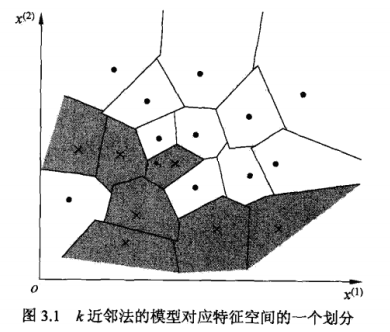
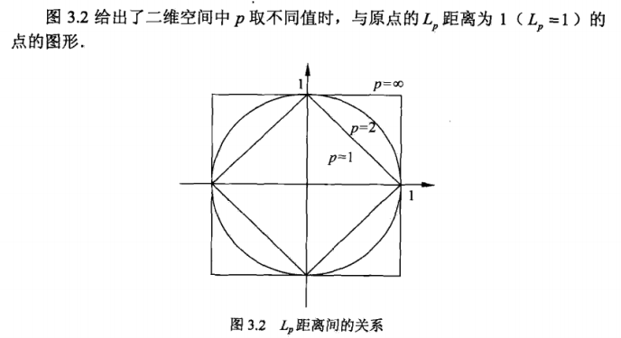
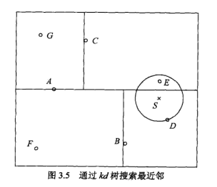
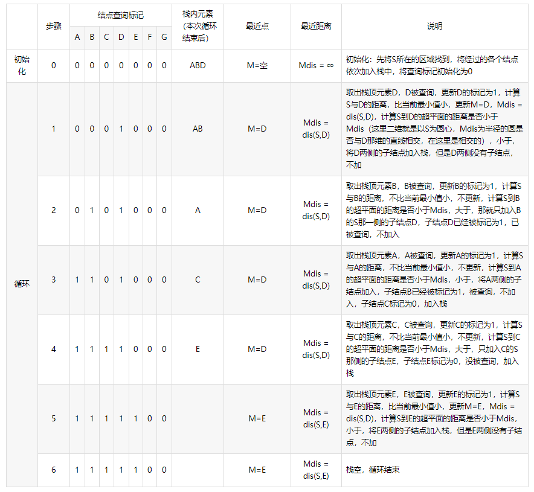

# **第三章 $K$近邻**
* 不具有显式的学习过程
* 三要素：
  * $k$值的选择
  * 距离度量
  * 分类决策规则

> 本章结构：

1. 叙述$k$近邻算法
2. 讨论$k$近邻模型及三要素
3. 实现方法：$kd$树

## **3.1 $k$近邻算法**
* 直观的定义：给定训练数据集，对新的输入，在训练数据集中找到与该实例最近的k个实例，这k个实例的多数属于某个类，就把该输入实例分到这个类。
* 特殊情况k=1，称为最近邻算法。

## **3.2 $k$近邻模型**
* 三要素：
  * $k$值的选择
  * 距离度量
  * 分类决策规则

### **3.2.1 模型**
* 三要素确定后，对任意输入，其所属的类唯一确定。相当于根据上述要素将特征空间划分为一些子空间。一个详细例子如图所示：

<div align=center>

</div>

### **3.2.2 距离度量**
* 距离即相似程度的反应
* $k$近邻模型使用的距离是欧氏距离，但也可以是其他距离。
* 假定特征空间$\chi$是$n$维实数向量空间$R^n$，$x_i,x_j\in \chi,x_i=(x_i^{(1)},x_i^{(2)},...,x_i^{(n)}),x_j=(x_j^{(1)},x_j^{(2)},...,x_j^{(n)})$，则两点之间$L_p$距离定义为：

$$
L_p(x_i,x_j)=\sqrt[{\frac{1}{p}}]{\sum _{l=1}^n \mid x_i^{(l)}-x_j^{(l)}\mid ^p}，这里p\geq 1\\
当p=2时，称为欧氏距离。\\
当p=1时，称为曼哈顿距离，即L_1(x_i,x_j)=\sum _{l=1}^n\mid x_i^{(l)}-x_j^{(l)}\mid \\
当p=\infty时，他是各个坐标距离的最大值，即L_{\infty}(x_i,x_j)=\max _l\mid x_i^{(l)}-x_j^{(l)}\mid \\
$$
* 如图：

<div align=center>

</div>


### **3.2.3 $k$值的选择**
* 在应用中，k值一般取较小值，通常采用交叉验证法选取k值。

### **3.2.4 分类决策规则**
* 分类决策规则一般采用多数表决法。

## **3.3 $k$近邻法的实现**
* 需要考虑的问题：如何对训练数据进行快速的$k$近邻搜索？
* 数据量很大时，线性扫描的方法（即计算输入实例与每一个训练集之间的距离）不可取，为提高搜索效率，一般采用特殊结构存储训练的数据，下面介绍$kd$树方法。

### **3.3.1 构造$kd$树**
* $kd$树
  * 一种对k维空间中的实例点进行存储以便于快速检索的树形结构。
  * 是一个二叉树，表示对二维空间的一个划分。
  * 构造kd树相当于不断用垂直于坐标轴的超平面将k维空间切分，构成一系列k维超矩形区域。
  * kd树每一个节点对应于一个超矩形区域。

对于数据集$T=\{x_1,x_2,...,x_n\}$，其中$x_i=(x_i^{(1)},x_i^{(2)},...,x_i^{(n)})^T,i=1,2,...,N;$

* 构造方法（平衡$kd$树，注意，平衡$kd$树搜索时效率未必是最优的）
  * 构造根节点，根节点对应k维空间中所包含的所有实例点的超矩形区域
    * 选定$x^{(1)}$为坐标轴
    * 以$T$中所有实例的$x^{(1)}$坐标的中位数为切分点，将k维空间切分为两个子区域
    * 切分平面过切分点且与$x^{(1)}$坐标轴垂直
    * 由根节点生成深度为1的左右子节点，左子节点对应坐标轴$x^{(1)}$小于切分点的子区域，右子节点相反。
  * 重复
    * 对深度为j的节点，选择$x^{(l)}$为切分的坐标轴，其中$l=j(mod \,k)+1$，其中k是维数。
    * 以$T$中所有实例的$x^{(l)}$坐标的中位数为切分点，将该节点对应的矩形区域切分为两个子区域
    * 生成深度为j+1的左右子节点。左子节点对应坐标轴$x^{(l)}$小于切分点的子区域，右子节点相反。
    * 将落在该超平面上的实例点保存在该节点。
  * 直到两个子区域没有实例存在时停止，形成$kd$树的区域划分。

* 例3.2
```python
import numpy as np

T = np.array([[2, 3], [5, 4], [9, 6], [4, 7], [8, 1], [7, 2]])
n = T.shape[0]
k = T.shape[1]


class Node(object):
    """
    节点类，用于创建二叉树
    """
    def __init__(self, item=None):
        self.elem = item
        self.l_child = None
        self.r_child = None


def traversal(node, mes):
    """
    二叉树遍历
    :param node: 根节点
    :param mes: 节点信息
    :return: None
    """
    if node is None:
        print('none')
        return
    print(node.elem, mes)
    traversal(node.l_child, 'l')
    traversal(node.r_child, 'r')


def build_kd_tree(_node, _depth, m_set):
    """
    创建二叉树
    :param _node: 待插入node节点
    :param _depth: 该node深度
    :param m_set: 待选定数据坐标集合
    :return: None
    """
    global k
    if len(m_set) == 0:
        return
    cut_dim = _depth % k
    len_set = len(m_set)
    mid = len_set // 2
    m_sort_set = sorted(m_set, key=lambda x: x[cut_dim])
    # print(m_sort_set)
    point = m_sort_set[mid]
    # print('choose: ', point)
    _node.elem = point
    # print(_node.elem)
    l_set = []
    r_set = []
    for _i in range(0, mid):
        l_set.append(m_sort_set[_i])
    for _i in range(mid + 1, len(m_set)):
        r_set.append(m_sort_set[_i])

    if len(l_set) is not 0:
        _node.l_child = Node()
        build_kd_tree(_node.l_child, _depth + 1, l_set)
    if len(r_set) is not 0:
        _node.r_child = Node()
        build_kd_tree(_node.r_child, _depth + 1, r_set)


def main():
    """
    主函数
    :return: None
    """
    kd_node = Node()
    build_kd_tree(kd_node, 0, T)
    traversal(kd_node, 'root')


if __name__ == '__main__':
    main()
```
* 输出结果

```python
[7 2] root
[5 4] l
[2 3] l
none
none
[4 7] r
none
none
[9 6] r
[8 1] l
none
none
none
```
### **3.3.2 搜索$kd$树**
* 通过kd树搜索最近邻
* 算法3.3

<div align=center>

</div>

<div align=center>

</div>
> 以上图片来自：
————————————————
版权声明：本文为CSDN博主「cnblogs.com/qizhou/」的原创文章，遵循CC 4.0 BY-SA版权协议，转载请附上原文出处链接及本声明。
原文链接：https://blog.csdn.net/qq_37189298/article/details/104164718