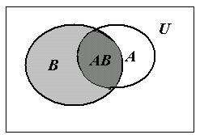
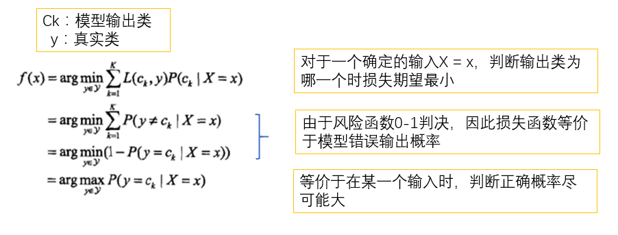
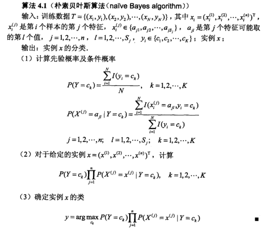

# **第四章 朴素贝叶斯法**
* 朴素贝叶斯法和贝叶斯估计是不同的概念。
  * 基于特征条件独立假设学习输入输出联合概率分布
  * 基于此模型给出后验概率最大的输出y
* 本章叙述：
  * 朴素贝叶斯法
  * 学习与分类
  * 参数估计算法

## **4.1 朴素贝叶斯法的学习与分类**

### **4.1.1 基本方法**
* 关于贝叶斯定理，以下摘一段 wikipedia 上的简介：

> 所谓的贝叶斯定理源于他生前为解决一个“逆概”问题写的一篇文章，而这篇文章是在他死后才由他的一位朋友发表出来的。在贝叶斯写这篇文章之前，人们已经能够计算“正向概率”，如“假设袋子里面有 N 个白球，M 个黑球，你伸手进去摸一把，摸出黑球的概率是多大”。而一个自然而然的问题是反过来：“如果我们事先并不知道袋子里面黑白球的比例，而是闭着眼睛摸出一个（或好几个）球，观察这些取出来的球的颜色之后，那么我们可以就此对袋子里面的黑白球的比例作出什么样的推测”。这个问题，就是所谓的逆向概率问题。

* 贝叶斯定理是关于随机事件A和B的条件概率：

$$
P(A|B)=\frac{P(B|A)P(A)}{P(B)}\\
P(A)是 A 的先验概率，之所以称为“先验”是因为它不考虑任何 B 方面的因素。\\

P(A|B)是已知 B 发生后 A 的条件概率，也由于得自 B 的取值而被称作 A 的后验概率。\\

P(B|A)是已知 A 发生后 B 的条件概率，也由于得自 A 的取值而被称作 B 的后验概率。\\

P(B)是 B 的先验概率，也作标淮化常量（normalizing constant）。\\
$$


* 由以上术语得：

$$
A的后验概率=B的后验概率*A的先验概率/B的先验概率\\
后验概率=（相似度*先验概率）/标准化常量
$$


* 有时将P(B|A)/P(B)也有时被称作标淮相似度（standardised likelihood）：

$$
后验概率 = 标淮相似度 * 先验概率
$$

> 以上原文：http://blog.csdn.net/kesalin/article/details/40370325


* 证明

> 条件概率公式：
> $$
P(A|B)=\frac{P(AB)}{P(B)}
> $$
> <div align=center>
> 
> </div>
> 同样的：
> 
> $$
P(B|A)=\frac{P(AB)}{P(A)}
> $$
> 两式联立：
> $$
P(A|B)P(B)=P(AB)=P(B|A)P(A)
> $$
> 上式同时除以P(B)或P(A)，若P(B)或P(A)非0，则：
> $$
P(A|B)=\frac{P(B|A)P(A)}{P(B)}\\
或：P(B|A)=\frac{P(A|B)P(B)}{P(A)}\\
> $$

* 例子：
> * 医院早上收6了个病人：
> 
> 症状|职业|疾病
> :-:|:-:|:-:
> 打喷嚏|护士|感冒
> 打喷嚏|农夫|过敏
> 头痛|建筑工人|脑震荡
> 头痛|建筑工人|感冒
> 打喷嚏|教师|感冒
> 头痛|教师|脑震荡
> * 现在来了第7个病人，是打喷嚏的建筑工人，问患上感冒的概率多大？
> 
> 由贝叶斯定理得：
> $$
P(感冒|打喷嚏x建筑工人)\\
　　　　　　 = P(打喷嚏*建筑工人|感冒) * P(感冒)\\
　　　　/ P(打喷嚏*建筑工人)\\
> $$
> 假定“打喷嚏”与“建筑工人”两个特征是独立的，则：
> $$
P(感冒|打喷嚏x建筑工人)\\
　　　　　　　　　= P(打喷嚏|感冒) * P(建筑工人|感冒) * P(感冒)\\
　　　　　/ P(打喷嚏) * P(建筑工人)\\
即：P(感冒|打喷嚏x建筑工人)= 0.66 * 0.33 * 0.5 / 0.5 * 0.33= 0.66
> $$

* 朴素贝叶斯分类器的公式

> 假设输入$X=x=\{x^{(1)},x^{(2)},...,x^{(n)}\}$，现有$k$个分类，分别为$c_1、c_2、...、c_m$。贝叶斯分类器就是计算出所有种类中概率最大的那个分类，即：
> $$
P(Y=c_k|X=x)= \frac{P(X=x|Y=c_k)P(Y=c_k)}{P(X=x)}
> $$
> 由全概率公式：
> $$
P(C)=P(L_1)P(C|L_1)+···+P(L_n)P(C|L_n)=\sum _{i=1}^n P(L_i)P(C|L_i)
> $$
> 即：
> $$
P(Y=c_k|X=x)= \frac{P(X=x|Y=c_k)P(Y=c_k)}{\sum _{i=1}^k P(Y=c_i)P(X=x|Y=c_i)}
> $$
> 由独立性假设得：
> $$
P(X=x|Y=c_k)=P(X^{(1)}=x^{(1)},...,X^{(n)}=x^{(n)}|Y=c_k)\\
=\prod_{j=1}^n P(X{(j)}=x{(j)}|Y=c_k)
> $$
> 综合上述，得：
> $$
P(Y=c_k|X=x)= \frac{P(X=x|Y=c_k)P(Y=c_k)}{\sum _{i=1}^k P(Y=c_i) \prod_{j=1}^n P(X{(j)}=x{(j)}|Y=c_k) }
> $$
> 于是朴素贝叶斯分类器可表示为：
> $$
y=f(x)=a\argmax_{c_k} \frac{P(X=x|Y=c_k)P(Y=c_k)}{\sum _{i=1}^k P(Y=c_i) \prod_{j=1}^n P(X{(j)}=x{(j)}|Y=c_k) }
> $$
> 注意到，式子中分母对于所有$c_k$都是相同的，所以：
> $$
y=f(x)=a\argmax_{c_k} P(Y=c_k)\prod_{j=1}^n P(X{(j)}=x{(j)}|Y=c_k)
$$

### **4.1.2 后验概率最大化的含义**
* 假设选取的是0-1损失函数，

$$
L(Y,f(X))=\begin{cases} 1 & Y \neq f(x) \\ 0 & Y = f(x) \end{cases} 
$$
* 此时期望风险函数为：

$$
R_{exp}(f)=E[L(Y,f(x))]\\
=\int _{x·y}L(Y,f(x))P(x,y)\,dxdy\\
=\int _{x·y}L(Y,f(x))P(y|x)P(X=x)\,dxdy\\
=\int _x \overbrace{\int _y L(Y,f(x))P(y|x)dy}^{条件期望} \,P(X=x)dx\\

$$
* 要使期望风险函数最小，在$P(X=x)$为常数情况下，内层积分要最小，即条件期望最小，在离散情况下条件期望：

$$
R_{exp}(f)=E_x \sum _{k=1}^K[L(c_k,f(X))P(c_k|X)

$$
* 使期望风险最小化，就要对$X=x$逐个极小化，得：

$$
f(x)=\argmin_{y\in Y} \sum _{k=1}^K L(c_k,y)P(c_k|X=x)\\
=\argmin_{y\in Y} \sum _{k=1}^K P(y\not ={c_k}|X=x)\\
=\argmin_{y\in Y} (1-P(y\not ={c_k}|X=x))\\
=\argmin_{y\in Y} P(y ={c_k}|X=x)\\
$$

* 解释：

<div align=center>

</div>

> 以上图片来自：https://blog.csdn.net/rea_utopia/article/details/78881415

* 因此，根据期望风险最小化准则得到后验概率最大化准则：

$$
f(x)=\argmin_{c_k} P(c_k|X=x)\\
$$

## **4.2 朴素贝叶斯法的参数估计**

### **4.2.1 极大似然估计**
* 在朴素贝叶斯法中，学习就意味着估计$P(Y=c_k)$和$P(X^{(j)}=x^{(j)}|Y=c_k)$，可以使用极大似然估计法。
* $P(Y=c_k)$得极大似然估计：

$$
P(Y=c_k)=\frac{\sum_{i=1}^N I(y_i=c_k)}{N},k=1,2,...,K
$$
* 设第$j$个特征 可能取值集合为$\{a_{j1},a_{j2},...,a_{jS_j}\}$，条件概率$P(X^{(j)}=x^{(j)}|Y=c_k)$的极大似然估计是：

$$
P(X^{(j)}=x^{(j)}|Y=c_k)=\frac{\sum_{i=1}^N I(x_i^{(j)}=a_{jl},y_i=c_k)}{\sum_{i=1}^N I(y_i=c_k)}\\
j=1,2,...,n;l=1,2,...,s_j;k=1,2,...,K\\
式中，x_i^{(j)}是第i个样本的第j个特征，a_{jl}是第j个特征可能取值的第l个值。
$$

### **4.2.2 学习与分类算法**
* 算法

<div align=center>

</div>

* 例 4.1

```python
import numpy as np

"""
已知条件：
"""
T = np.array([[1, 'S', -1], [1, 'M', -1], [1, 'M', 1], [1, 'S', 1], [1, 'S', -1],
              [2, 'S', -1], [2, 'M', -1], [2, 'M', 1], [2, 'L', 1], [2, 'L', 1],
              [3, 'L', 1], [3, 'M', 1], [3, 'M', 1], [3, 'L', 1], [3, 'L', -1]], dtype=np.str)

Max = 80

Y = np.array([-1, 1], dtype=np.str)
A1 = np.array([1, 2, 3], dtype=np.str)
A2 = np.array(['S', 'M', 'L'], dtype=np.str)

"""
演算：
"""

A = np.array([len(A1), len(A2)])
A_fill = np.array([[1, 2, 3], ['S', 'M', 'L']], dtype=np.str)

N = len(T)
T_j = len(T[0]) - 1  # 特征数

p_ij = np.zeros(shape=(len(Y), T_j, Max))

global y

x = np.array([2, 'S'])  # 输入


def P_Y_ck():
    """
    对数据集来说，不同分类的概率
    :return: 不同分类的概率
    """
    global T, N
    _y_1 = 0
    _y_2 = 0
    for i in range(N):
        if T[i][2] == '-1':
            _y_1 += 1
        else:
            _y_2 += 1
    return _y_1, _y_2


def filling_P():
    """
    填充概率矩阵
    :return: None
    """
    global T, N, Y, A_fill, p_ij, y
    for yi in range(len(Y)):
        for xi in range(T_j):
            for _l in range(A[xi]):
                temp = 0
                for t in range(N):

                    if T[t][2] == Y[yi] and T[t][xi] == A_fill[xi][_l]:
                        temp += 1
                p_ij[yi][xi][_l] = temp / y[yi]


def out():
    """
    输出概率矩阵
    :return: None
    """
    print('计算结果:')
    for yi in range(len(Y)):
        for xi in range(T_j):
            for _l in range(A[xi]):
                print(p_ij[yi][xi][_l], end=' ')
            print()


def prediction():
    """
    进行预测
    :return: 最可能结果及其概率
    """
    global x
    m = np.zeros(T_j, dtype=np.int)
    for i in range(T_j):
        for j in range(A[i]):
            if A_fill[i][j] == x[i]:
                m[i] = j
    _res = 0
    _res_y = 0
    for yi in range(len(Y)):
        p = 1
        for xi in range(T_j):
            p *= p_ij[yi][xi][m[xi]]
        p *= y[yi] / N
        if p >= _res:
            _res = p
            _res_y = Y[yi]
    return _res, _res_y


def main():
    global y
    y_1, y_2 = P_Y_ck()
    y = [y_1, y_2]
    filling_P()
    # out()
    res, res_y = prediction()
    print('预测结果: y = ', res_y, '概率: p = ', res)


if __name__ == '__main__':
    main()
```
* 运行结果

```python
预测结果: y =  -1 概率: p =  0.06666666666666667
```


### **4.2.3 贝叶斯估计**
* 极大似然估计容易产生概率值为0的情况，解决该问题的方法是采用贝叶斯估计。

* 具体的，条件概率的贝叶斯估计(产生矩阵时)是：

$$
P_\lambda(X^{(j)}=a_{jl}|Y=c_k)=\frac{\sum_{i=1}^N I(x_i^{(j)}=a_{jl},y_i=c_k)+\lambda}{\sum_{i=1}^N I(y_i=c_k)+S_j\lambda}\\
式中，\lambda \geq0，当\lambda=0时，就是极大似然估计。常取\lambda=1，称为拉普拉斯平滑。\\
显然，对于任何l=1,2,...,S_j,k=1,2,...,K,有：\\
P_\lambda(X^{(j)}=a_{jl}|Y=c_k)>0\\
\sum_{l=1}^{S_j}P(X^{(j)}=a_{jl}|Y=c_k)=1
$$
* 同样，先验概率的贝叶斯估计是：

$$
P_\lambda(Y=c_k)=\frac{\sum_{i=1}^N I(y_i=c_k)+\lambda}{N+K\lambda}

$$
* 例4.2
```python
import numpy as np

"""
已知条件：
"""
T = np.array([[1, 'S', -1], [1, 'M', -1], [1, 'M', 1], [1, 'S', 1], [1, 'S', -1],
              [2, 'S', -1], [2, 'M', -1], [2, 'M', 1], [2, 'L', 1], [2, 'L', 1],
              [3, 'L', 1], [3, 'M', 1], [3, 'M', 1], [3, 'L', 1], [3, 'L', -1]], dtype=np.str)

Max = 80

Y = np.array([-1, 1], dtype=np.str)
A1 = np.array([1, 2, 3], dtype=np.str)
A2 = np.array(['S', 'M', 'L'], dtype=np.str)

"""
演算：
"""

A = np.array([len(A1), len(A2)])
A_fill = np.array([[1, 2, 3], ['S', 'M', 'L']], dtype=np.str)

N = len(T)
T_j = len(T[0]) - 1  # 特征数

_lambda = 1

p_ij = np.zeros(shape=(len(Y), T_j, Max))

global y

x = np.array([2, 'S'])  # 输入


def P_Y_ck():
    """
    对数据集来说，不同分类的概率
    :return: 不同分类的概率
    """
    global T, N, _lambda, T_j
    _y_1 = 0
    _y_2 = 0
    for i in range(N):
        if T[i][2] == '-1':
            _y_1 += 1
        else:
            _y_2 += 1
    return _y_1, _y_2


def filling_P():
    """
    填充概率矩阵
    :return: None
    """
    global T, N, Y, A_fill, p_ij, y, _lambda, T_j, A
    for yi in range(len(Y)):
        for xi in range(T_j):
            for _l in range(A[xi]):
                temp = 0
                for t in range(N):
                    if T[t][2] == Y[yi] and T[t][xi] == A_fill[xi][_l]:
                        temp += 1
                temp += _lambda
                p_ij[yi][xi][_l] = temp / (y[yi] + A[xi])


def out():
    """
    输出概率矩阵
    :return: None
    """
    print('计算结果:')
    for yi in range(len(Y)):
        for xi in range(T_j):
            for _l in range(A[xi]):
                print(p_ij[yi][xi][_l], end=' ')
            print()


def prediction():
    """
    进行预测
    :return: 最可能结果及其概率
    """
    global x, _lambda, T_j
    m = np.zeros(T_j, dtype=np.int)
    for i in range(T_j):
        for j in range(A[i]):
            if A_fill[i][j] == x[i]:
                m[i] = j
    _res = 0
    _res_y = 0
    for yi in range(len(Y)):
        p = 1
        for xi in range(T_j):
            p *= p_ij[yi][xi][m[xi]]
        p *= (y[yi] + _lambda) / (N + T_j * _lambda)
        if p >= _res:
            _res = p
            _res_y = Y[yi]
    return _res, _res_y


def main():
    global y
    y_1, y_2 = P_Y_ck()
    y = [y_1, y_2]
    filling_P()
    # out()
    res, res_y = prediction()
    print('预测结果: y = ', res_y, '概率: p = ', res)


if __name__ == '__main__':
    main()
```

* 运行结果

```python
预测结果: y =  -1 概率: p =  0.061002178649237467
```

