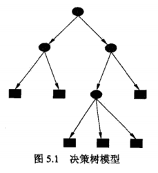
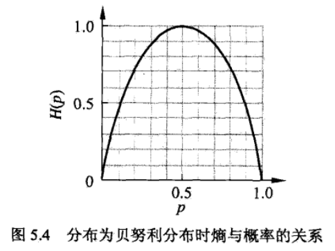
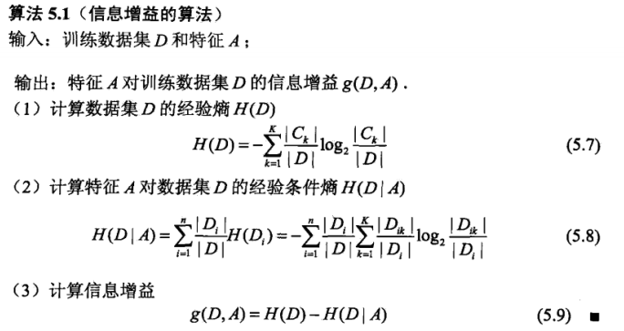
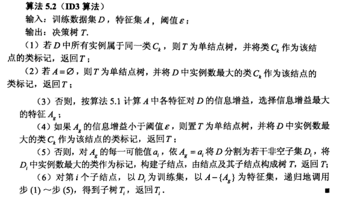
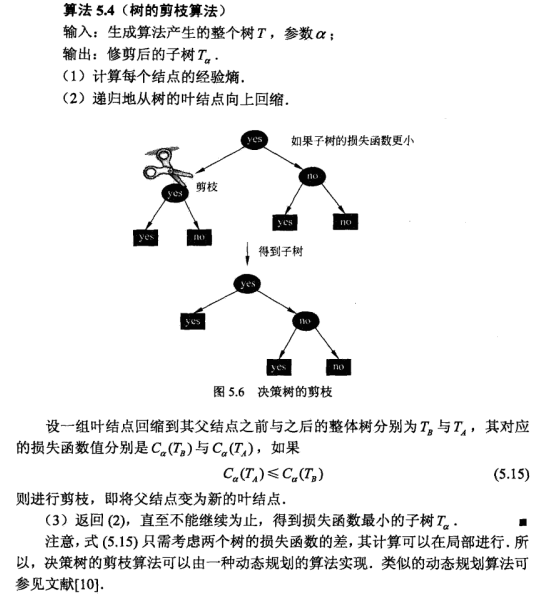
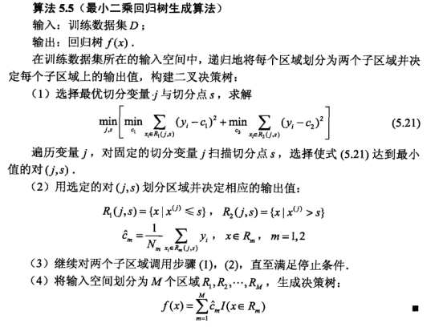
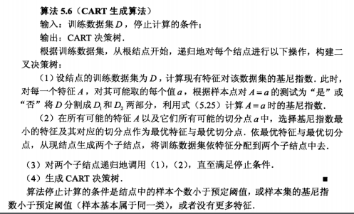
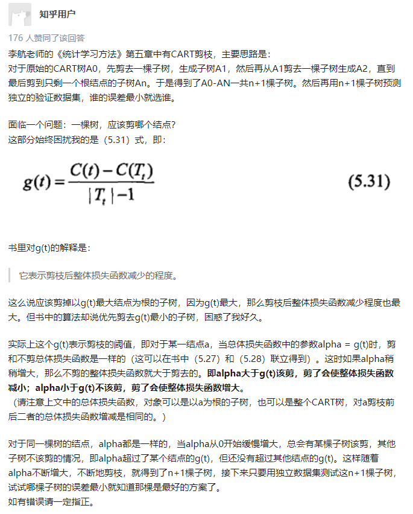
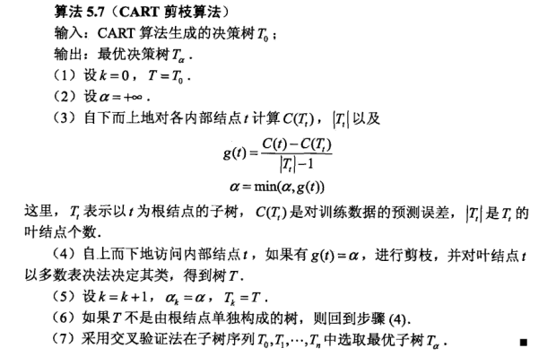

# **第五章 决策树**
* 本章讨论用于分类的决策树。
* 可认定为if-then规则集合
* 决策树的学习过程
  * 特征选择
  * 决策树生成
  * 决策树修剪

* 优点
  * 模型具有可读性
  * 分类速度快

1. 决策树基本概念
2. ID3和C4.5介绍特征选择、决策树的生成以及决策树的修剪
3. CART算法

## **5.1 决策树模型与学习**

### **5.1.1 决策树模型**
* 定义：分类决策树是一种描述对实例进行分裂的树形结构，由节点和有向边组成。节点有两种类型：内部节点和叶节点。内部节点表示一个特征或属性，叶节点表示一个类。
* 决策树示意图：
<div align=center>

</div>


### **5.1.2 决策树与if-then规则**
* 每一个实例都被有且只有一条规则所覆盖

### **5.1.2 决策树与概率分布**


### **5.1.3 决策树学习**
* 算法过程
  * 构建根节点，将所有数据集都放在根节点
  * 选择一个最优特征，按这一特征将训练数据集分割成子集，使各个子集有一个在当前条件下的最好分类。
  * 若这些子集都已经基本正确分类，那么构建叶节点，并将子集分到所对应的叶节点。
  * 否则重新选取最优特征，继续分割。直至所有训练数据集基本正确分类。

* 易产生过拟合，需要剪枝。

## **5.2 特征选择**
### **5.2.1 特征选择问题**

* 特征选择在于选取对训练数据集具有分类能力的特征，通常特征选择的标准是信息增益或信息增益比。
* 特征选择是决定用哪个特征来划分特征空间。
* 确定选择的准则：直观上，如果一个特征具有更好的分类能力，使得各个子集在当前条件下有最好的分类，那么就选择这个特征。信息增益可以很好的表示这一直观准则。

### **5.2.2 信息增益**

* 为了便于说明，先给出熵与条件熵的定义。
* 在信息论与概率统计中马，熵是表示随机变量不确定性的度量。

$$
设X是一个取有限个值的离散随机变量，其概率分布为：\\
P(X=x_i)=p_i,i=1,2,...,n\\
则随机变量X的熵定义为：H(X)=-\sum _{i=1}^np_i\log p_i\\
若p_i=0,则定义0\log 0=0.通常式中对数以2为底或以e为底\\
这时熵的单位分别称作比特或纳特。因定义可知，熵只依赖于X的分布，因此将X的熵记作H(p)，即：\\
H(p)=-\sum _{i=1}^np_i\log p_i
$$
* 熵越大，随机变量的不确定性就越大。
* 证：$0\leq H(p)\leq \log n$

> 证明：
> $$
\because\,0\leq p_i\leq 1，
\therefore \,\log p_i \leq 0，
\therefore\,H(p)\geq 0\\
又均匀分布时熵最大，取p_i=\frac{1}{n}\\
得H(p)=\log n\\
\therefore 0\leq H(p)\leq \log n
> $$

* 当随机变量只取两个值，如1，0时，即：

> X分布为：
> $$
P(X=1)=p,P(x=0)=1-p,0\leq p\leq 1\\
熵为：H(p)=-p\log_2p-(1-p)\log_2(1-p)
> $$
> 此时熵与概率p的变化曲线如图所示：
> <div align=center>
> 
> </div>
> 当p=0或p=1时，熵等于0，随机变量完全没有不确定性。当p=0.5时，熵最大。

* 设有随机变量$(X,Y)$，其联合概率分布为

$$
P(X=x_i,Y=y_i)=p_{ij};i=1,2,...,n;j=1,2,...,m
$$
* 条件熵$H(Y|X)$表示在已知随机变量$X$的条件下随机变量$Y$的不确定性。定义为$X$给定条件下$Y$的条件概率分布的熵对$X$的数学期望：

$$
H(Y|X)=\sum_{i=1}^n p_iH(Y|X=x_i)\\
这里，p_i=P(X=x_i),i=1,2,...,n.
$$

* [条件熵的解释可见知乎](https://zhuanlan.zhihu.com/p/26551798)
* 若熵与条件熵由数据估计（特别是极大似然估计）得到时，所对应的熵与条件熵分别称为经验熵和经验条件熵。
* 信息增益表示：得知特征X的信息而使类Y的信息的不确定性减少的程度。
* **定义5.2（信息增益）** 特征$A$对训练数据集$D$的信息增益$g(D,A)$，定义为集合$D$的经验熵$H(D)$与特征$A$给定条件下$D$的条件经验熵$H(D|A)$之差，即：

$$
g(D,A)=H(D)-H(D|A)\\
一般的，熵H(Y)与条件熵H(Y|X)之差称为互信息。\\
决策树学习中的信息增益等价于训练数据集中类与特征的互信息。
$$

* 决策树学习应用信息增益准则选择特征。信息增益大的特征具有更强的分类能力。
* 根据信息增益的特征选择方法是：对训练数据集$D$，计算其每个特征的信息增益，并比较大小，选择信息增最大的特征。
* **算法5.1（信息增益的算法）**

<div align=center>

</div>

* 例5.2
```python
import numpy as np
from math import log2

D = np.array([
    ['青年', '否', '否', '一般', '否'],
    ['青年', '否', '否', '好', '否'],
    ['青年', '是', '否', '好', '是'],
    ['青年', '是', '是', '一般', '是'],
    ['青年', '否', '否', '一般', '否'],
    ['中年', '否', '否', '一般', '否'],
    ['中年', '否', '否', '好', '否'],
    ['中年', '是', '是', '好', '是'],
    ['中年', '否', '是', '非常好', '是'],
    ['中年', '否', '是', '非常好', '是'],
    ['老年', '否', '是', '非常好', '是'],
    ['老年', '否', '是', '好', '是'],
    ['老年', '是', '否', '好', '是'],
    ['老年', '是', '否', '非常好', '是'],
    ['老年', '否', '否', '一般', '否']
], dtype=np.str)

MAX = 10

t_k_ = np.array([3, 2, 2, 3, 2])  # 各个域的大小
t_k = np.array([
    ['青年', '中年', '老年'],
    ['是', '否'],
    ['是', '否'],
    ['一般', '好', '非常好'],
    ['是', '否']
])

c_k = np.zeros((len(t_k_), MAX), dtype=np.int)

D_ = len(D)  # 样本数
t_ = len(D[0]) - 1  # 特征数

HDA = np.zeros(t_)


def get_HDA():
    """
    计算经验条件熵
    :return: None
    """
    global HDA, D, t_, t_k, t_k_, c_k, D_
    for ti in range(t_):  # 待计算特征A下标
        res = 0
        for yi in range(t_k_[t_]):  # 对于每一个分类
            temp = 0
            for ki in range(t_k_[ti]):  # 对于该特征的每一个取值
                for di in range(D_):  # 对于每一个数据集
                    if D[di][ti] == t_k[ti][ki] and D[di][t_] == t_k[t_][yi]:
                        temp += 1
                res += (c_k[ti][ki] / D_) * (t(temp, c_k[ti][ki]))
                temp = 0
        HDA[ti] = res


def get_C_k():
    """
    统计各个特征的各种取值的个数
    :return: None
    """
    global D_, D, t_, c_k, t_k_, t_k
    for ti in range(t_ + 1):  # 待计算特征A下标
        for ki in range(t_k_[ti]):  # 对于该特征的每一个取值
            for di in D:
                if di[ti] == t_k[ti][ki]:
                    c_k[ti][ki] += 1


def get_HD(ti, _d_):
    """
    计算经验熵
    :param ti: 最终分类所在下标
    :param _d_: 分母，即数据集大小
    :return: 计算结果，即数据集D的经验熵
    """
    global D, D_, t_k_, t_, c_k
    res = 0
    for i in range(t_k_[ti]):
        res += t(c_k[ti][i], _d_)
    return res


def t(_ck, _n):
    """
    计算log
    :param _ck: 出现频次
    :param _n: 总数
    :return: 计算结果
    """
    if _ck == 0:
        return 0
    temp = _ck / _n
    return -temp * log2(temp)


def main():
    """
    主函数
    :return: None
    """
    global t_, D_
    get_C_k()
    HD = get_HD(t_, D_)
    get_HDA()
    res = 0
    j = 0
    for i in range(t_):
        if HD - HDA[i] >= res:
            res = HD - HDA[i]
            j = i
    print('选择特征为A', j + 1, '信息增益为', res)


if __name__ == '__main__':
    main()
```
* 运行结果

```python
选择特征为A 3 信息增益为 0.4199730940219748
```

### **5.2.3 信息增益比**
* 以信息增益作为划分数据集的特征，存在偏向于选择取值较多的特征问题。使用信息增益比可以对这一问题进行矫正，这是特征选择的另一准则。
* 信息增益比定义为信息增益$g(D,A)$与训练数据集$D$关于特征$A$的值的熵$H_A(D)$之比。即：

$$
g_R(D,A)=\frac{g(D,A)}{H_A(D)}\\
其中，H_A(D)=-\sum _{i=1}^n\frac{\mid D_i \mid}{\mid D \mid}\log_2 \frac{\mid D_i \mid}{\mid D \mid}
$$

## **5.3 决策树的生成**
### **5.3.1 ID3算法**

<div align=center>

</div>

### **5.3.2 C4.5算法**

* ID3使用信息增益作为特征选择的度量
* C4.5使用信息增益比作为特征选择的度量

## **5.4 决策树剪枝**
* 在决策树学习中将已生成的树进行简化的过程叫做剪枝。
* 剪枝通过**极小化**决策树整体的**损失函数或代价函数**来实现。
* 决策树的学习的损失函数定义为：

$$
C_\alpha(T)=\sum_{t=1}^{|T|}N_tH_t(T)+\alpha |T|\\
其中H_t(T)=-\sum_k\frac{N_{tk}}{N_t}\log \frac{N_{tk}}{N_t}\\
将C(T)=-\sum_{t=1}^{|T|}\sum_k\frac{N_{tk}}{N_t}\log \frac{N_{tk}}{N_t}\\
即：C_\alpha(T)=C(T)+\alpha|T|
$$

<div align=center>

</div>

## **5.5 CART算法**
* 分类与回归树，是应用广泛的决策树学习方法。
* CART算法**假设**决策树是二叉树，左分支为“是”的分支，右分支为“否”的分支。
  * 决策树的生成
  * 决策树剪枝

### **5.5.1 CART生成**
* 递归构建二叉决策树的过程
* 对回归树用平方误差最小化准则
* 对分类树用基尼指数最小化准则

> 分类树与回归树区别：
> 
> 分类树主要用于将数据集分类到响应变量所对应的不同类别里，通常响应变量对应两类0 or 1. 如果目标变量对应了2个以上的类别，则需要使用分类树的一个扩展版C4.5（很popular）。然而对于一个二分类问题，常常使用标准的CART算法。不难看出分类树主要用于响应变量天然对应分类的情况。
> 
> 回归树主要用于响应变量是数值的或者连续的，例如预测商品的价格，其适用于预测一些非分类的问题。
> 
> 以上摘自：https://www.cnblogs.com/yxy8023ustc/p/3421146.html

* 回归树的生成

> 一个回归树对应着输入控件的一个划分以及在该划分的单元上的输出值。假设将输入划分为$M$个单元$R_1,R_2,...,R_M$，并且在每个单元$R_m$上有固定的输出值$c_m$，于是回归树模型可以表示为：
> $$
f(x)=\sum _{m=1}^M c_mI(x\in R_m)
> $$
> 输入空间划分确定时，平方误差为$\sum _{x_i\in R_m}(y_i-f(x_i))^2$
> 
> 单元$R_m$上的$c_m$的最优值$\hat{c}_m$是$R_m$上的所有输入$x_i$对应的输出$y_i$的均值，即：
> $$
\hat{c}_m=ave(y_i|x_i\in R_m)
> $$
> 问题是如何对输入空间进行划分？这里采用启发式的方法。
> 
> * 循环取第j个变量x和他的取值s，作为切分变量和切分点
> * 定义两个区域R1和R2,使$R_1(j,s)=\{x|x^{(j)}\leq s\},R_2(j,s)=\{x|x^{(j)}\leq s\}$
> * 寻找最佳切分点，使得
> $$
\min_{j,s}[\min_{c_1}\sum_{x_i\in R_1(j,s)}(y_i-c_1)^2+\min_{c_2}\sum_{x_i\in R_2(j,s)}(y_i-c_2)^2]\\
其中\hat{c}_1=ave(y_i|x_i\in R_1(j,s)),\hat{c}_2=ave(y_i|x_i\in R_2(j,s))
> $$
> * 算法：
> <div align=center>
> 
> </div>

* 分类树的生成

> 分类树用基尼指数选择最优特征，同时决定该特征的最优二值切分点。
> 
> **定义 5.4 （基尼指数）**分类问题中，假设有$K$个类，样本点属于第$k$类的概率为$p_k$，则概率分布的基尼指数定义为：
> $$
Gini(p)=\sum_{k=1}^Kp_k(1-p_k)=1-\sum_{k=1}^Kp_k^2
> $$
> 若二分类问题中，样本点属于第一个类的概率是$p$，则概率分布的基尼指数为：
> $$
Gini(p)=2p(1-p)
> $$
> 对于给定的样本集合$D$，其基尼指数为：
> $$
Gini(D)=1-\sum_{k=1}^K(\frac{|C_k|}{|D|})^2
> $$
> 若样本$D$根据特征$A$是否取某一值$a$被分为$D_1$和$D_2$两部分，即
> $$
D_1=\{(x,y)\in D|A(x)=a\},D_2=D-D_1
> $$
> 则在特征A条件下，集合D的基尼指数为：
> $$
Gini(D,A)=\frac{|D_1|}{|D|}Gini(D_1)+\frac{|D_2|}{|D|}Gini(D_2)
> $$
> $Gini(D)$表示集合$D$的不确定性，基尼指数$Gini(D,A)$表示经过$A=a$分割后集合$D$的不确定性，基尼指数越大，样本集合的不确定性就越大。
> 
> **算法：**
> <div align=center>
> 
> </div>

### **5.5.2 CART剪枝**
1. 从生成的决策树$T_0$的底端开始不断剪枝，直到$T_0$的根节点，形成一个子树序列$\{T_0,T_1,...,T_n\}$
2. 通过交叉验证法在独立的验证数据集上进行测试，从中选择最优子树。

* 剪枝，形成子树序列

> 理解：
> <div align=center>
> 
> </div>

* 选择最优子树

* CART剪枝算法

<div align=center>

</div>
