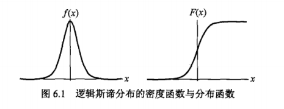
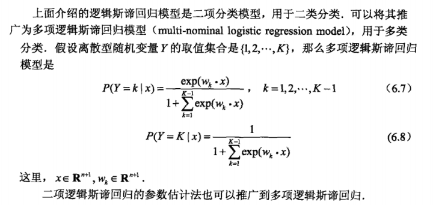
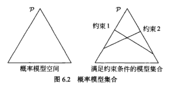
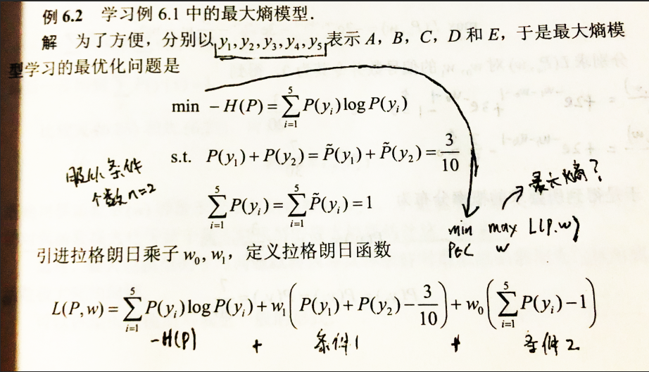
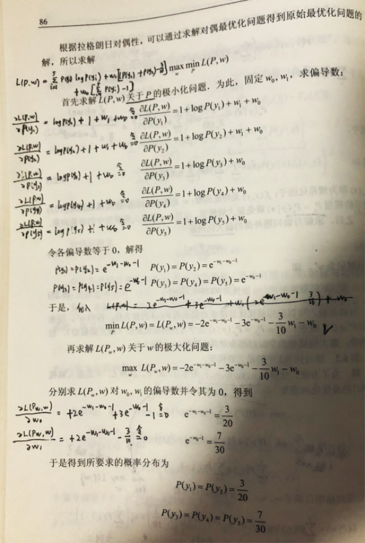
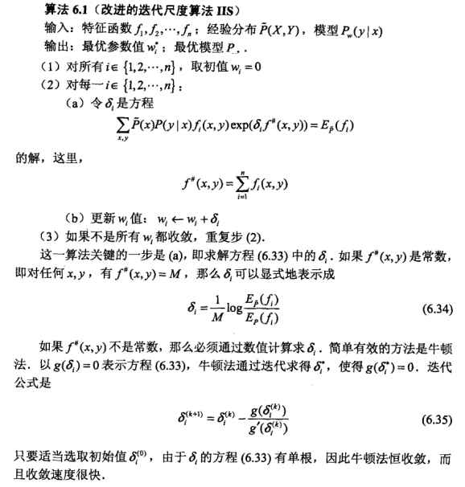
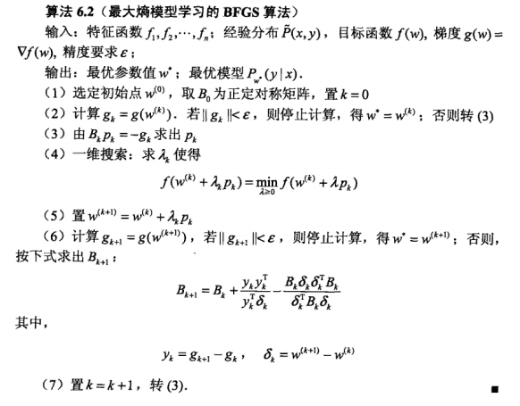

# **第六章 逻辑斯蒂回归与最大熵模型**
* 逻辑斯蒂回归是统计学习中经典的分类方法。
* 最大熵是概率模型学习的一个准则，推广到分类问题得到最大熵模型。
* 二者都属于对数线性模型

1. 逻辑斯蒂回归模型
2. 最大熵模型
3. 两模型的学习算法，包括改进的迭代尺度算法和拟牛顿法

## **6.1 逻辑斯蒂回归模型**

### **6.1.1 逻辑斯蒂分布**
* **定义 6.1 （逻辑斯蒂分布）**设X为连续随机变量，X服从逻辑斯蒂分布是指X具有下列分布函数和密度函数：

$$
F(x)=P(X\leq x)=\frac{1}{1+e^{-(x-\mu)/\gamma}}\\
f(x)=F\prime(x)=\frac{e^{-(x-\mu)/\gamma}}{\gamma(1+e^{-(x-\mu)/\gamma})^2}\\
其中，\mu为位置参数，\gamma\geq0为形状参数。满足：\\
F(-x+\mu)-\frac{1}{2}=-F(x+\mu)+\frac{1}{2}\\
中心点为(\mu,\frac{1}{2})，\gamma越小，在中心附近增长越快。
$$
* 逻辑斯蒂分布的密度函数和分布函数如图所示：

### **6.1.2 二项逻辑斯蒂回归模型**
* 二项逻辑斯蒂回归模型是一种分类模型
* **定义 6.2 （逻辑斯蒂回归模型）**二项逻辑斯蒂回归模型是如下条件概率分布：

$$
P(Y=1|x)=\frac{exp(w·x+b)}{1+exp(w·x+b)}\\
P(Y=0|x)=\frac{1}{1+exp(w·x+b)}\\
将w与x扩充，得：\\
P(Y=1|x)=\frac{exp(w·x)}{1+exp(w·x)}\\
P(Y=0|x)=\frac{1}{1+exp(w·x)}\\
考虑一个事件得几率，是指该事件发生与不发生得概率之比，若事件发生概率为p，则该事件对数几率：\\
logit(p)=\log \frac{p}{1-p}\\
对于逻辑斯蒂回归，对数几率：\\
\log \frac{P(Y=1|x)}{1-P(Y=1|x)}=w·x
$$

### **6.1.2 模型参数估计**
> 逻辑斯蒂回归模型学习时，可使用极大似然估计法：
> 
> 设：
> $$
P(Y=1|x)=\pi(x),P(Y=0|x)=1-\pi(x)
> $$
> 似然函数为：
> $$
\prod_{i=1}^N [\pi(x_i)]^{y_i}[1-\pi(x_i)]^{1-y_i}
> $$
> 对数似然函数为：
> $$
\sum_{i=1}^N [y_i\log \pi(x_i)+(1-y_i)\log (1-\pi(x_i))]\\
=\sum_{i=1}^N [y_i(w·x_i)-\log (1+exp(w·x))]\\
> $$
* 这样问题就变成以对数似然函数为目标函数得最优化问题。

### **6.1.4 多项逻辑斯蒂回归**

## **6.2 最大熵模型**

### **6.2.1 最大熵原理**
* 最大熵原理认为，学习概率模型时，在所有可能的概率模型中，熵最大的模型是最好的模型。即当服从均匀分布时，熵最大。

* 几何解释：

### **6.2.2 最大熵模型得定义**
* 经验分布函数 https://www.cnblogs.com/liuhuacai/p/12729290.html
* **定义 6.3 （最大熵模型）**假设满足所有约束条件的模型集合为

$$
C\equiv\{P\in \rho|E_p(f_i)=E_{\widetilde{P}}(f_i),i=1,2,...,n\}
$$
* 则模型集合中条件熵最大的模型称为最大熵模型。

### **6.2.3 最大熵模型得学习**
* 书上推导暂不理解，但例6.2可以看懂：

### **6.2.4 极大似然估计**
* 证明：对偶函数极大化等价于最大熵模型得极大似然估计

## **6.3 模型学习得最优化算法**

### **6.3.1 改进的迭代尺度法**

### **6.3.2 拟牛顿法**

